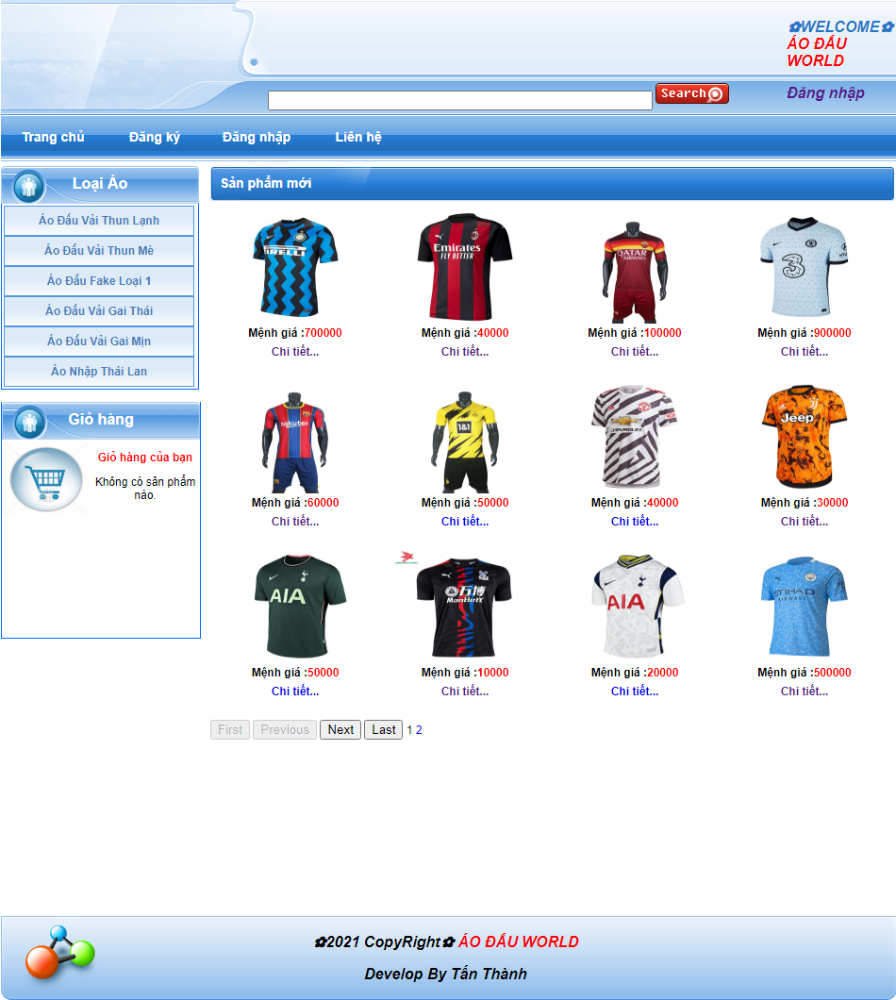
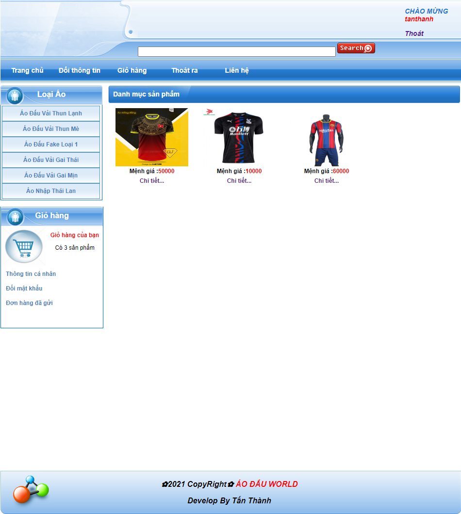
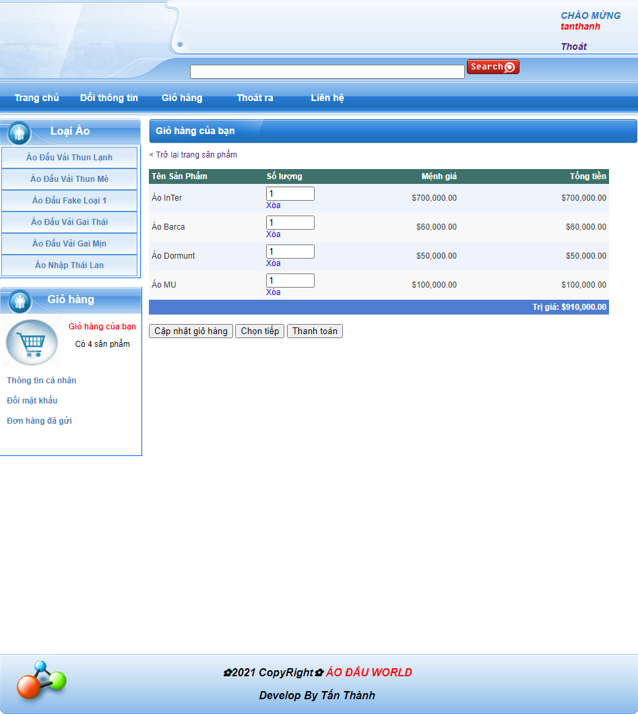
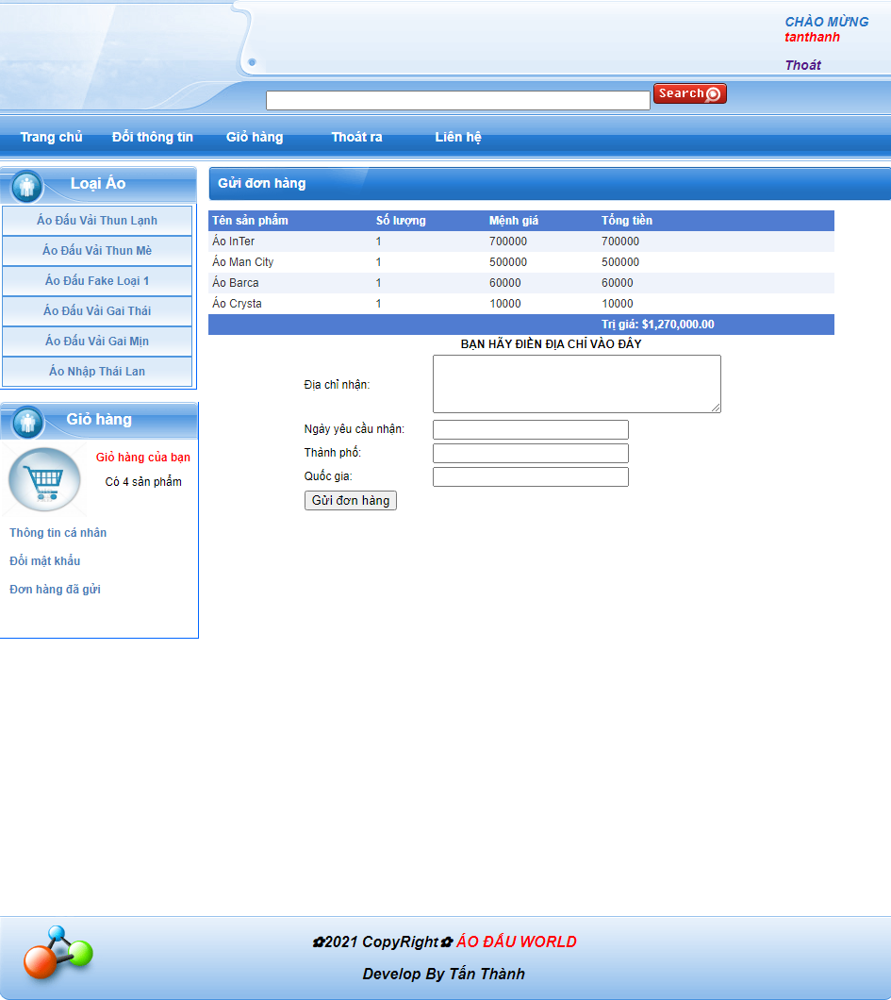
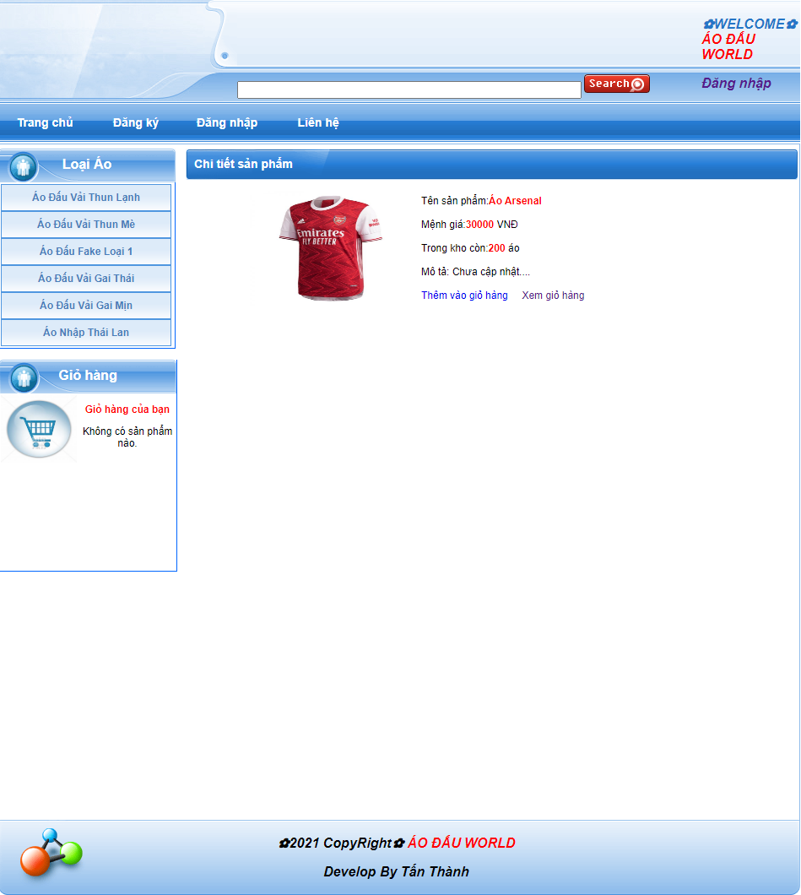
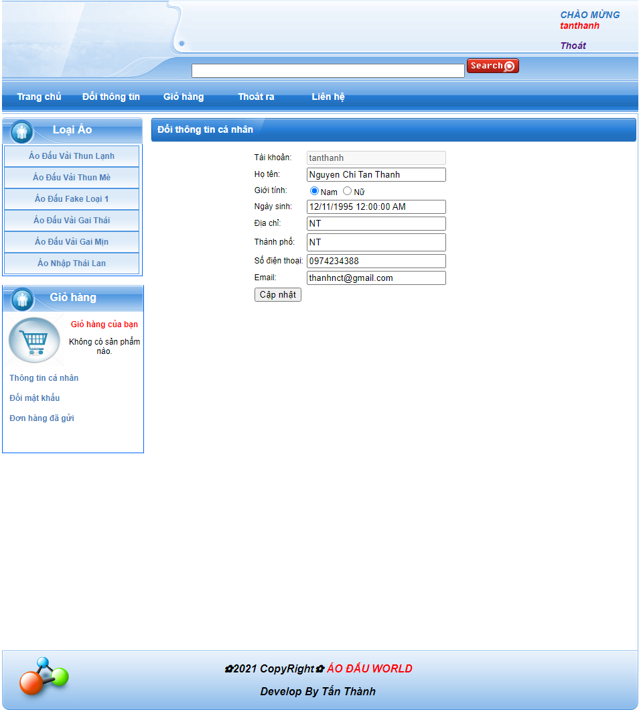
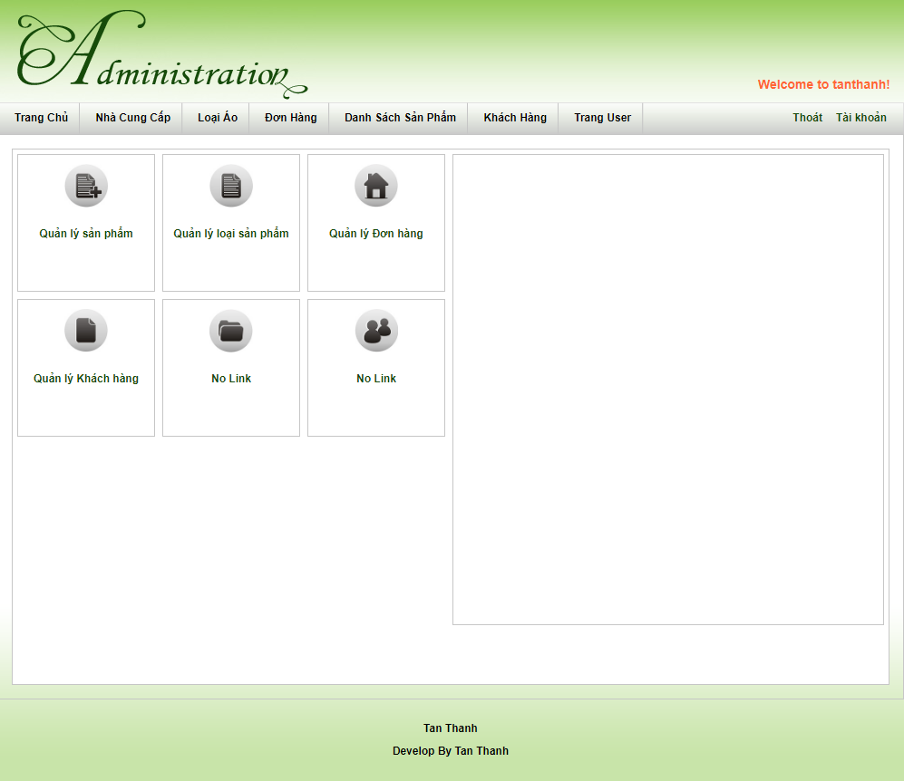
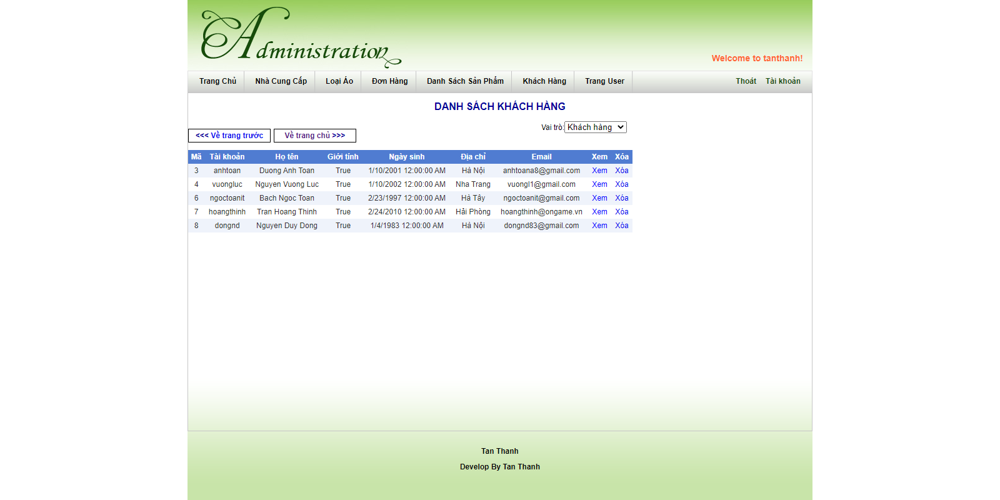
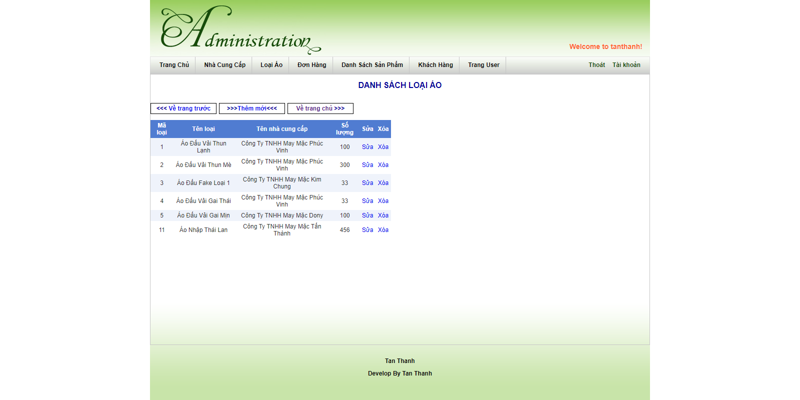

- DỰ ÁN KẾT THÚC MÔN ASP.NET (4.X) - WEBSITE BÁN ÁO ĐẤU BÓNG ĐÁ

- Họ và Tên: Nguyễn Chí Tấn Thành
- Lớp: CTT13CD3A
- Dự án Website: Bán áo đấu bóng đá ||  Thời gian: 
- Ngôn ngữ : ASP.NET, html, css, js
- Kiểu CSDL: SQL (.bak)
- Một số chức năng Website: 
    - Đăng nhập quyền quản trị trang
    - Thêm vào giỏ hàng
    - Chi tiết giỏ hàng
    - Cập nhật giỏ hàng
    - Tổng tiền đơn hàng
    - Chức năng chọn tiếp
    - Chức năng thanh toán
    - Xem thông tin cá nhân
    - Đăng ký tài khoản
    - Đổi mật khẩu tài khoản
    - Theo dõi đơn hàng đã gửi
    - Số lượng đã chọn
    - Mệnh giá mỗi món đã chọn

------------------------------------------------------
---MỘT SỐ TRANG CHỤP WEBSITE ---
## Default.aspx

## Products.aspx?TypeID=1

## ShoppingCart.aspx

## CreateOrder.aspx

## ProductDetail.aspx?ID=17

## ChangeProfile.aspx

## Trang của Admin (Administrator/Default.aspx)

## Trang của Admin (Administrator/Customers.aspx)

## Trang của Admin (Administrator/Categories.aspx)

## Cơ Sở Dữ Liệu

